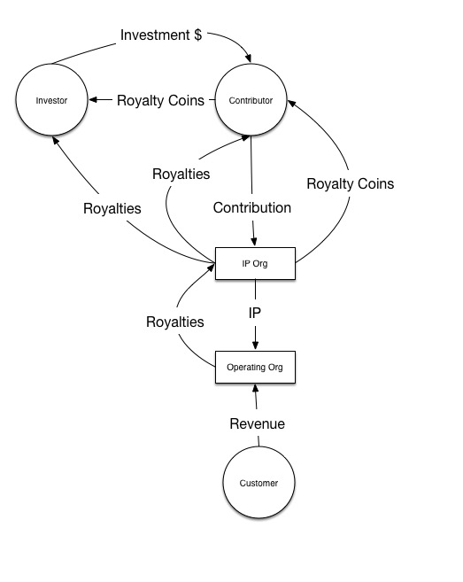
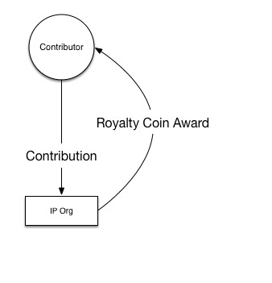
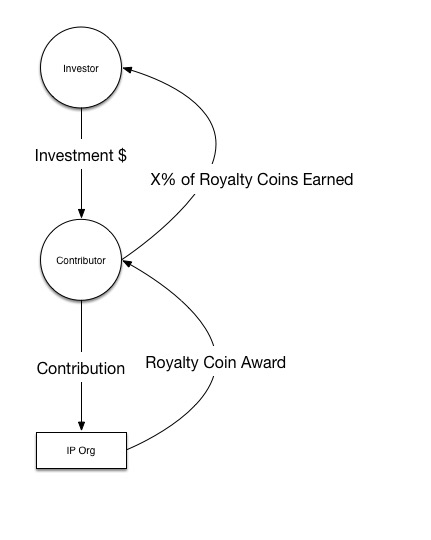
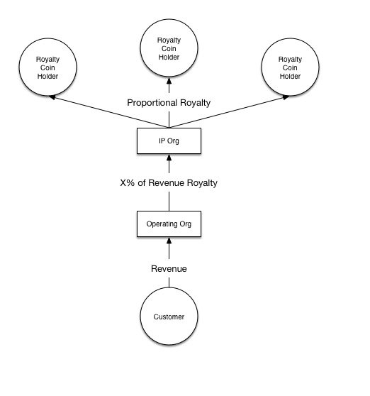
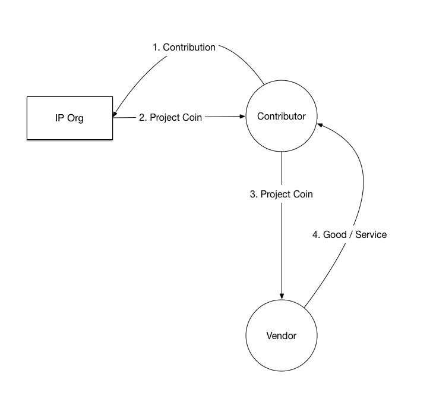

# The Dynamic Organization
### A Smart Contract Compatible Legal Structure for Open Innovation

### By [@noahthorp](http://twitter.com/noahthorp)
*Co-founder at [Citizen Code](http://citizencode.io), <noah@citizencode.io>*

Here is the [early operating agreement draft](license.md) for a lightweight legal entity to support an **open innovation business model**. It is intended to solve structural challenges faced by incubators, freelancer collaborators, investors, and open innovation contributors. It strives to be both innovative and legally compliant.

#### Legal

For maximum usability, these legal documents are hereby licensed under the Creative Commons CC0 public domain dedication: http://creativecommons.org/publicdomain/zero/1.0

The text in this README is licensed as a Creative Commons CC-BY 4.0 license. You may adapt and distribute it with attribution to the contributors listed in the Attribution section.
https://creativecommons.org/licenses/by/4.0/

## Feedback

Opening a [Github issue](https://github.com/citizencode/dynamic-equity-organization/issues) is a great way to give us feedback on your desires and concerns. We will be integrating this feedback into future revisions or variations of the contract. If Github issues are not your style you can send an email to <noah@citizencode.io>.

## How It Works

**The Open Innovation Business Model**

- Core contributors accept contributions in exchange for royalty tokens
- Operations companies (e.g. web hosts, software distributors, manufacturers) pay royalties for use of the IP to token holders

**Open Innovation Business Model Benefits**
- Open Source contributors benefit financially from their contributions (massive for creators)
- Low cost, light weight organizations come into existence using contract law rather than state filings
- Optimized for compatibility with smart contracts to automate payment, distribution of royalties, licensing, and legal compliance
- Open source code can be adapted to specific use cases
- Open contribution leads to more ingenious solutions and bug detection
- Open contribution model aligns the incentives of a wider range of contributors and beneficiaries which reduces competition
- Core contributors create project continuity
- Royalty distribution model means free services remain free for those who don’t charge (i.e. commons)

**The Dynamic Organization engages in a limited set of actions**
- manages distribution of Royalty Coins in exchange for Contributions
- holds the IP
- manages a table of Royalty Coins

 The Dynamic Org never needs to deal directly with fiat currency and so **no fiat bank account is needed**. It only deals in the Royalty Coins that it creates. Royalties can be distributed directly to royalty coin holders via a smart contract using bitcoin or other payment software.

Contributions are filtered by a core team. The governance structure will define how decision making authority and budgets are delegated to core members. It also will define rapid iterative agreement amendment to adapt to the unknown.

The license dynamically allocates "Coins" backed by the value of royalty revenue. This is done without the necessity of debt, investment, or legal filings (looking into this). This provides resilience to entrepreneurs as well as those without access to capital in the developing world, collapsed economies, and recessions. These Coins can be issued and tracked transparently on a blockchain with a tool like [Swarmbot](https://github.com/citizencode/swarmbot).

### Contributors Earn Royalty Coins For Contributions

### Investors Receive Royalty Coins By Supporting Contributors

### Royalty Coin Holders Receive Royalties From Revenues

### Royalty Coins Can Be Traded as a Complimentary Currency

Backed by the value of the IP and the IP Royalty stream.

### Example

Using open source software as an example, here's how royalties are distributed. Individuals or companies pay a royalty fee for revenue made by hosting, selling, or distributing licensed software. Open source contributors, product managers, designers, and marketers receive a percentage of royalties in proportion to the work they do. This work is tracked through the distribution of Coins on a ledger managed by the organization. The coins are brought into existence by the contract in the repository.

## Background

Research by Swarm.fund on lightweight unincorporated associations in California as a basis for token issuance indicates a promising direction. Simply signing an agreement specified in the license brings an unincorporated association into existence without the requirement of filing paperwork with the government. The jurisdiction the association is formed in is of particular concern and requires further investigation regarding limitation of liability, the holding of assets, and tax ramifications.

Although the license is targeted to be created simply by people signing an agreement (ie unincorporated assocation), the license should be suitable for conversion into an LLC operating agreement. This allows the agreement to function as a founders agreement if a different legal structure is required.

Ideally open source contributors would be free to trade Coins for money if they choose. This potentially enables compatibility with new [SEC crowd funding rules](http://www.sec.gov/news/pressrelease/2015-249.html) that go into effect on January 29th, 2016. Relatedly, investors who want to further the development of software can pay contributors to make contributions in exchange for a portion of the contribution Coins that contributors earn. Although it does not bypass accredited investor rules, this avoids the need to pay money directly to the organization. Cash for equity negotiations can occur at the edge of the organization which may avoid the necessity of the organization opening a bank account.

The first version of the license is intended to be suitable for software development with just git repository tracking. However automated services can also track dynamic issuance such as Citizen Code's [SwarmBot](https://github.com/citizencode/swarmbot) and Enspiral's [CoBudget](https://github.com/cobudget).

If you are committed to using this approach for your product, investment, or service offering let <noah@citizencode.io> know! Your early enthusiasm encourages us to continue iterating.

## Attribution

Many thanks (and no blame) for pioneering and helping develop the concepts explored here.

Attribution goes to:
* Noah Thorp (Citizen Code)
* Jesse Posner
* Joel Dietz (Swarm)
* Derek Razo (Enspiral)
* Tony Lai (LawGives)
* Chelsea Robinson (Enspiral)
* Matthew Schutte
* Primavera De Fillipi
* Christopher Allen
* Alexis Gonzales-Black
* Harlan Wood
* Matthew Dieters
* Art Brock
* Gunther Sonnenfeld
* Andrew Markell
* Digital Catapult
* [Citizen Code](http://citizencode.io).

## DISCLAIMER

This is an experimental license. This should not be construed as legal advice.
